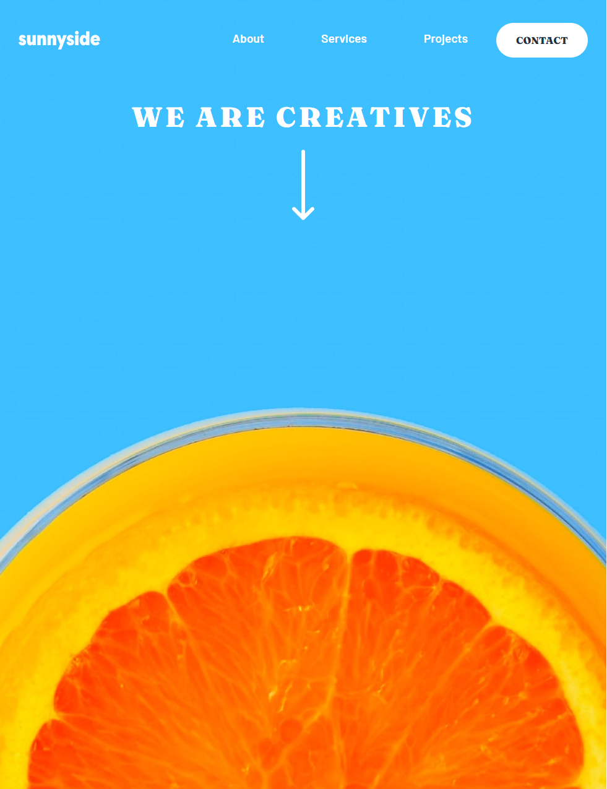
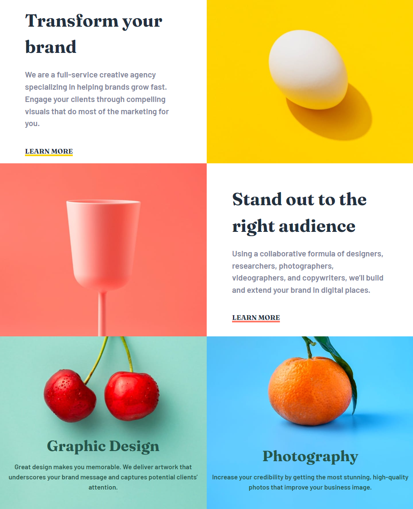
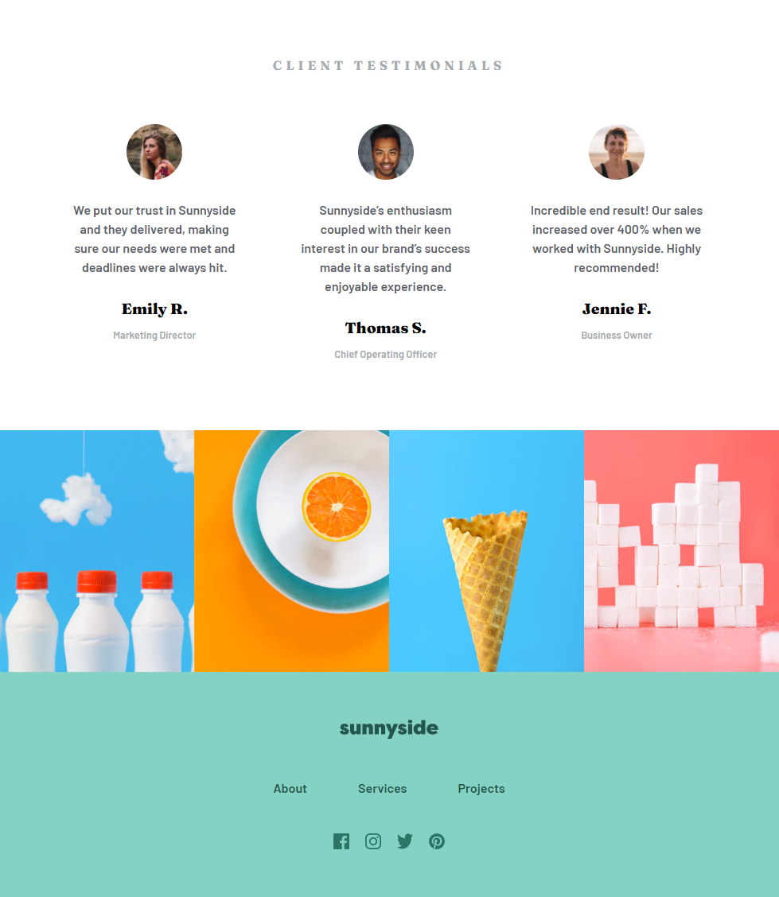
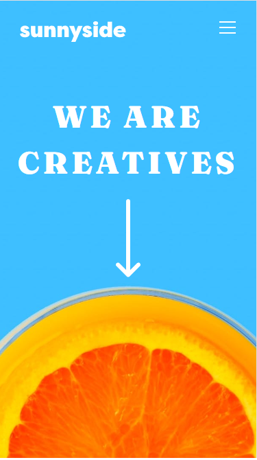
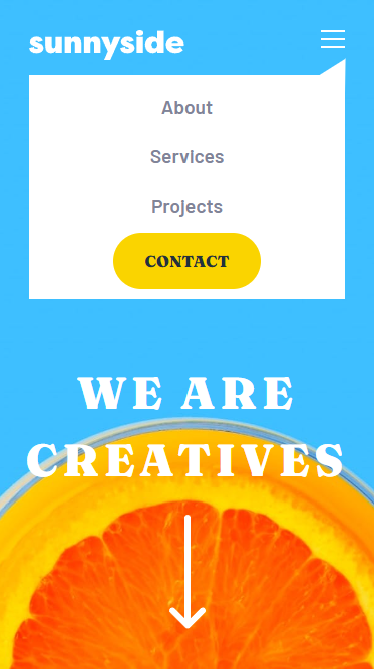
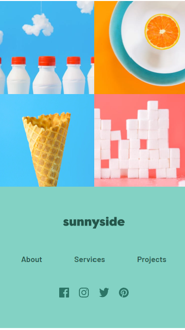

# Frontend Mentor - Sunnyside agency landing page solution

This is a solution to the [Sunnyside agency landing page challenge on Frontend Mentor](https://www.frontendmentor.io/challenges/sunnyside-agency-landing-page-7yVs3B6ef). Frontend Mentor challenges help you improve your coding skills by building realistic projects.

## Table of contents

- [Overview](#overview)
  - [The challenge](#the-challenge)
  - [Screenshot](#screenshot)
  - [Links](#links)
- [My process](#my-process)
  - [Built with](#built-with)
  - [What I learned](#what-i-learned)
  - [Continued development](#continued-development)
- [Author](#author)

**Note: Delete this note and update the table of contents based on what sections you keep.**

## Overview

### The challenge

Users should be able to:

- View the optimal layout for the site depending on their device's screen size
- See hover states for all interactive elements on the page

### Screenshot

### Links

- Live Site URL: [https://sunny-side-ms.netlify.app/](https://sunny-side-ms.netlify.app/)

## My process

### Built with

- Semantic HTML5 markup
- Sass preprocesor
- Flexbox
- CSS Grid
- JavaScript
- Mobile-first workflow

### What I learned

This project was great to remember how to create a responsive website and to practice Flexbox.

### Continued development

Above all, I need to focus on continuing to learn more about responsive websites.
And creating pages using React.

## Author

- Frontend Mentor - [@mslysz](https://www.frontendmentor.io/profile/mslysz)
